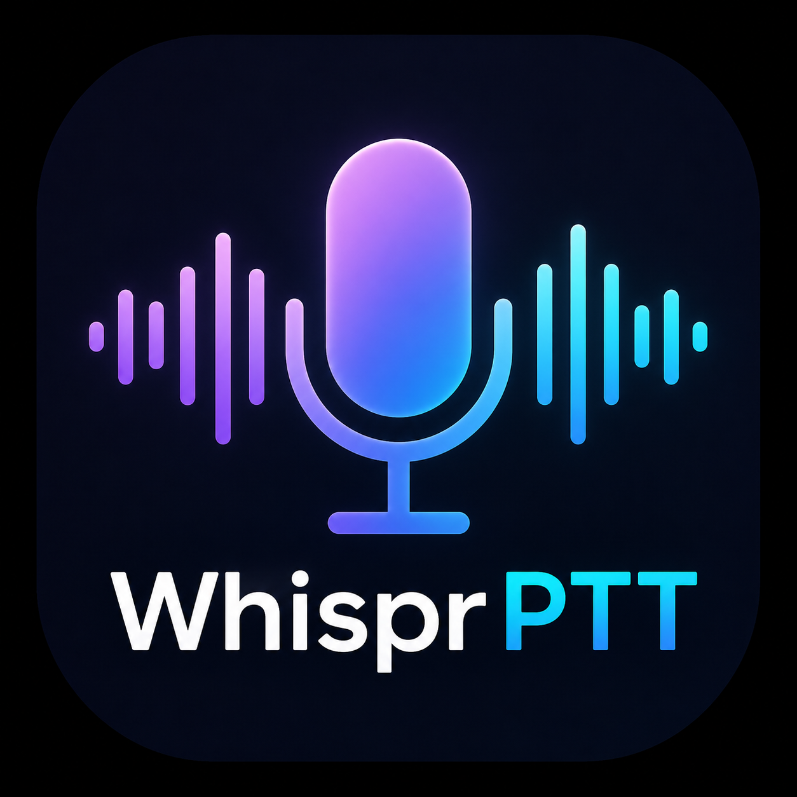

# WhisprPTT

<p align="center">
  
</p>

<p align="center">
  Push-to-talk speech-to-text dictation. Hold a button, speak, release — your words appear at the cursor.<br>
  Runs as a system tray app. No cloud, no internet. Everything stays on your machine.
</p>

---

## How it works

1. Hold **Right Ctrl** or **Mouse X2** (forward thumb button) to start recording
2. Speak
3. Release — your words are transcribed and typed at wherever your cursor is
4. Works in any app: browsers, editors, chat, email, terminals

WhisprPTT sits silently in your system tray. Right-click the icon to change settings or quit.

---

## Windows

### Option A — Download the prebuilt exe (easiest)

1. Go to [Releases](../../releases) and download the latest `whispr.zip`
2. Extract the zip to any folder
3. Double-click `whispr.exe`
4. A mic icon appears in the system tray — you're ready

> **SmartScreen warning:** Windows may show "Windows protected your PC" the first time. Click **More info → Run anyway**. This is standard for unsigned open-source apps.

> **First run:** WhisprPTT downloads the Whisper speech model (~240 MB) on first launch. This happens once and is cached for all future runs.

### Option B — Run from source

**Requirements:** Windows 10/11, [Python 3.10+](https://python.org/downloads)

```bat
:: 1. Clone the repo
git clone https://github.com/bjoernsn/whisprPTT.git
cd whisprPTT

:: 2. Create virtual environment and install dependencies (one-time)
setup.bat

:: 3. Run
.venv\Scripts\activate
python whispr_ptt.py
```

### Option C — Build the exe yourself

```bat
build.bat
```

Output lands in `dist\whispr\`. Zip that folder and copy it to any Windows machine — no Python required on the target.

---

## macOS

There is no prebuilt `.app` yet for macOS. You need to run from source.

**Requirements:** macOS 12+, Python 3.10+

### 1. Install system dependencies

WhisprPTT uses PyAudio for microphone access, which requires PortAudio:

```bash
# Install Homebrew if you don't have it
/bin/bash -c "$(curl -fsSL https://raw.githubusercontent.com/Homebrew/install/HEAD/install.sh)"

# Install PortAudio
brew install portaudio
```

### 2. Clone and install Python dependencies

```bash
git clone https://github.com/bjoernsn/whisprPTT.git
cd whisprPTT

python3 -m venv .venv
source .venv/bin/activate
pip install -r requirements.txt
```

### 3. Grant permissions

macOS requires two permissions for WhisprPTT to work. You'll be prompted automatically on first run, but you can also set them in advance:

**Accessibility** (required to monitor keypresses and type text):
> System Settings → Privacy & Security → Accessibility → add Terminal (or your Python app)

**Microphone** (required to record audio):
> System Settings → Privacy & Security → Microphone → add Terminal (or your Python app)

If you run from a built `.app` in the future, grant permissions to that app instead of Terminal.

### 4. Run

```bash
source .venv/bin/activate
python whispr_ptt.py
```

### Notes for Mac users

- **Mouse X2** (forward thumb) doesn't exist on MacBook trackpads — use **Right Ctrl** as your hotkey, or plug in a mouse and configure a different button in settings
- **Apple Silicon (M1/M2/M3):** fully supported, runs on CPU which is fast enough for `small` models
- **CUDA GPU acceleration** is not available on Mac — the app always uses CPU
- A prebuilt `.app` bundle for Mac is planned for a future release

---

## Settings

Right-click the tray icon to access all settings. Changes take effect immediately and are saved automatically.

| Menu | Options | Default |
|---|---|---|
| **Microphone** | All detected input devices + System default | System default |
| **Language** | English, German, French, Indonesian, Spanish, Auto-detect | English |
| **Hotkey** | Right Ctrl, Left Ctrl, Right Alt, Right Shift, Caps Lock, Scroll Lock | Right Ctrl |
| **Record Button** | X2 (Forward thumb), X1 (Back thumb), Middle button, Disabled | X2 (Forward thumb) |
| **Enter Button** | X2 (Forward thumb), X1 (Back thumb), Middle button, Disabled | X1 (Back thumb) |

**Enter Button** sends a Return/Enter keystroke on click — useful for submitting messages hands-free after dictating.

Settings are stored in `config.json` next to the executable (or script). You can edit it directly if needed.

### Finding your microphone index

If the wrong mic is being used, open a terminal and run:

```bash
# Windows
.venv\Scripts\activate && python whispr_ptt.py --list-mics

# macOS
source .venv/bin/activate && python whispr_ptt.py --list-mics
```

Then select the correct mic from the **Microphone** submenu in the tray.

### Changing the Whisper model

The default model (`small.en` for English, `small` for other languages) balances speed and accuracy well for most uses. To change it, edit `COMPUTE_TYPE` and the model loaded in `_model_name()` at the top of `whispr_ptt.py`:

| Model | Size | Speed | Best for |
|---|---|---|---|
| `tiny.en` / `tiny` | ~75 MB | Fastest | Low-end hardware, quick notes |
| `base.en` / `base` | ~145 MB | Fast | Good balance for older machines |
| `small.en` / `small` | ~240 MB | Good | **Default — recommended** |
| `medium.en` / `medium` | ~770 MB | Slower | High accuracy needs |
| `large-v3` | ~1.5 GB | Slowest | Best possible accuracy |

---

## Troubleshooting

**Nothing is typed after I speak**
- Make sure the app is running (check the system tray)
- Try speaking louder — very quiet audio is filtered to prevent hallucinations
- Check that the correct microphone is selected in the Microphone submenu
- On Mac: verify Accessibility permission is granted for Terminal

**The wrong microphone is being used**
- Run `--list-mics` (see above) and select the correct one from the tray menu

**Recording starts but transcription is slow**
- The first transcription after launch is slower (model warm-up). Subsequent ones are faster.
- Switch to a smaller model (`tiny` or `base`) for faster results on slower hardware

**Mac: "Operation not permitted" error**
- Grant Microphone permission: System Settings → Privacy & Security → Microphone

**Mac: Keystrokes aren't being typed**
- Grant Accessibility permission: System Settings → Privacy & Security → Accessibility

**Windows SmartScreen blocks the exe**
- Click "More info" → "Run anyway". This warning appears for any unsigned executable.

---

## Privacy

All audio processing runs locally on your machine using [faster-whisper](https://github.com/SYSTRAN/faster-whisper). No audio, text, or usage data is ever sent to any server or third party.

---

## License

MIT
